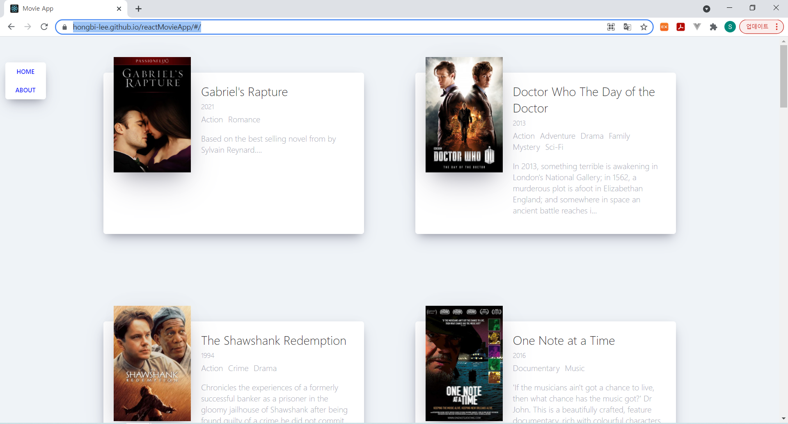

# Movie App 2021

Study (<small><a href="http://www.yes24.com/Product/Goods/90344496">Do it! 클론 코딩 영화 평점 웹서비스</a>로 배우는 리액트 기초</small>)
https://soy3on.tistory.com/88

## 🖥️ 결과
[](https://hongbi-lee.github.io/reactMovieApp/#/)

## ✔️ 배포 과정
### Github 배포하기

- package.json 파일 수정
```json
{
    scripts: {
        ...
        "predeploy": "npm run build",
        "deploy": "gh-pages -d build",
    }
    (생략...)
    
    browserslist: {
      ...
    },
    "homepage" : "https://{username}.github.io/{repositoryname}"
}
```

- gh-pages 설치
```
  npm install gh-pages
```

-  깃허브 저장소 다시 확인
```
  git remote -v
```

- 깃허브 배포
```
  npm run deploy
```
